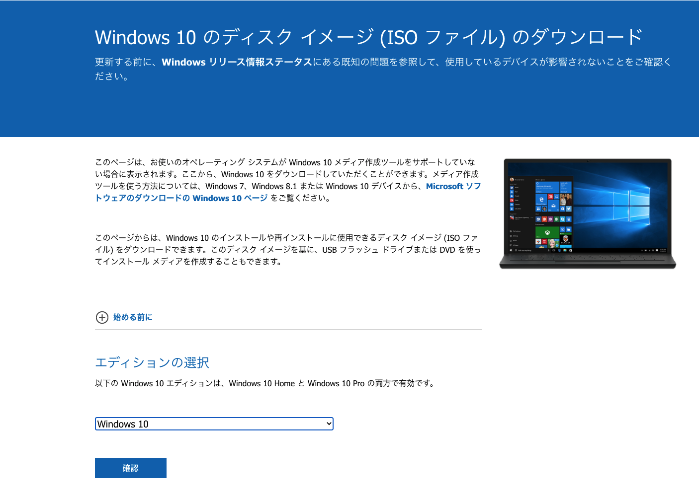

# Among Usをmacでやる!
とうのは建前でmacにwindowsの環境を作ってやるだけです
### 1. VirtualBox
[ここ](https://pc-karuma.net/mac-virtualbox-install/)を参考にVirtualBoxをmacに入れよう

### 2. VirtualBoxでWindows10の環境を作る
#### 2-1. widonws10 isoのダウンロード
[ここ](https://www.microsoft.com/ja-jp/software-download/windows10ISO)からwindows10のISOをダウンロード  

エディションで**windows10**を選択して**確認**   

言語は**日本語**を選択して**確認**  

**64-bit**をダウンロード

そうするとwindows10のisoのダウンロードが始まります.  
約5.3GBあるので多少時間かかるかもしれません.(僕は研究室のwifiでやったので1分くらいと爆速でした) 

#### 2-2. VirtualBoxにダウンロードさせたwindows10 isoをインストール
現在ダウンロードしたisoは`~/Downloads`下にあって`Win10_21H1_Japanese_x64.iso`の名称になっていると思います.  
これを`OS_iso`フォルダを作ってあげてそこにおいてあげましょう. 
terminalを開いて以下のように実行するとできます.  
~~~
cd
mkdir OS_iso
mv ~/Downloads/Win10_21H1_Japanese_x64.iso ~/OS_iso/
~~~

FinderでApplicationsを開いてVirtualBoxを開きましょう.  

Among UsをやるたびにVirtualBoxを開く必要があるので,以下のようにdockにおいてあげると良いでしょう.
  

VirtualBoxを開くと以下のようなVirtualBoxのマネージャーのウィンドウが出てきます.  
**新規(N)** を選択しましょう.  

以下のようなウィンドウが開くので,名前の部分をWindows10にしましょう.  
(自動でバージョンも変更されます.)  

次にRAMの割り当てがあるのですが、これは**8192MB(8GB)** 割り当てましょう.  
(無理な方は**4096MB** でも大丈夫だと思います.)  

ハードディスクの作成ではデフォルトの**仮想ハードディスクの作成する**を選びましょう.  

ハードディスクのファイルタイプはデフォルトの**VDI**を選択しましょう.  

物理ハードディスクのあるストレージは,今回はAmong Usをやるのが目的でWindows10で色々とやる予定はないので固定サイズを選択します.  

ファイルの場所とサイズではデフォルトのままで作成をしましょう.  

作成中...  

作成できました!  

そしたら上画像にある**設定(S)** をクリックしましょう.  
以下のような画面になったら,**ストレージ**をクリックしましょう.  

以下のような画面になると思います.  

以下のように**空**を選択して,その後**SATA ポート1**の隣にあるディスクアイコンから**ディスクファイルを選択**を選びましょう.  

そしたら先ほどダウンロードしたwindows10のisoを選択しましょう.  

選択したら以下のようになると思いますのでokを押しましょう.  

以上で設定は終わりなので**起動**してあげましょう!  

#### 2-3. Widows10のセットアップ
起動するとこのような画面になります,基本的には指示に沿っていけば大丈夫です.  

ライセンスの認証というパートではラインセンスを購入して使用してもいいですが2万円くらいと高いです.  
なので今回はライセンスなしで行きます.  
ライセンスなしでも特に問題ないです.(ラインセンスについて知りたいなら[ここ](https://itojisan.xyz/%E3%83%91%E3%82%BD%E3%82%B3%E3%83%B3%E3%81%AE%E7%9F%A5%E8%AD%98/windows10%E3%81%AE%E3%83%A9%E3%82%A4%E3%82%BB%E3%83%B3%E3%82%B9%E8%AA%8D%E8%A8%BC%E3%81%97%E3%81%AA%E3%81%84%E3%81%A8%E3%81%A9%E3%81%86%E3%81%AA%E3%82%8B/))
以下のようにライセンスの画面になったら,**プロダクトキーがありません**を選択しましょう.  

OSは**Windows 10 Home**を選択しましょう.  

ライセンス条項に同意しましょう.  

インストールの種類は下の方の**カスタム**を選びましょう.  

Windowsのインストール場所は以下のようにデフォルトのままで**次へ**行きましょう.  

Windowsインストール中...

インストールが完了したら再起動などもはさんで以下のようなアカウントを作成画面になります.  
Microsoftアカウントがある人はそれを使用してもいいですし,新しく作成でもいいと思います.  
ここまでお疲れ様でした,ようやくWindows10が使えます!  

#### 2-4. 下準備
この章はカスタマイズについてなので,とばしても一応問題ないです. 

とりあえずChromeでもダウンロードしておきましょう.  

ここでおそらくVirtualBoxでWindowsを使用している皆さんはVirtualBoxのウィンドウサイズを変更しても適用されない,macでコピーしたものがVirtualBoxでは機能しないなど不便を感じているかもしれません.  
それの解決方法を説明して行きます.  

### 3. Among Usを始めよう
#### 3-1. Steamのインストール
[ここ](https://zyoho3.com/?p=621)を参考にSteamをインストール
